# Battleships

Battleships is a Python based variation of the classic pencil and paper game (and later board game). This particular version runs in Code Institute's mock terminal on Heroku. Users will play against a computer opponent and try to guess the position of the computer's ships before their own ships are destroyed.

Link to the live version is as follows: 
https://battleships-jclarke.herokuapp.com/

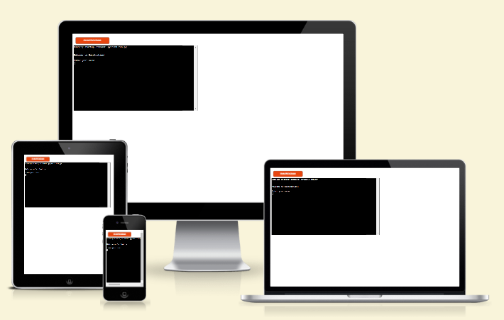

## How to Play

In this version of the game, rather than turns being alternate, both player and computer turns occur in a single round, thereby eliminating first turn advantage.

To begin, the player is asked to enter their name.

The player is then asked to set the size of the board, from a minimum of 3x3 up to a 6x6 grid. The number of ships per board depends on this selection.

Both player's and computer's boards are then displayed in the terminal. The player's ships are displayed on the board as a delta sign ( &#916; ). The computer's ships remain invisible.

The player is asked to choose a target on the board, after which the computer will choose a target on the player's board. Hits are marked with an "X", whereas misses are marked with a "O".

After each round, the number of ships remaining for both player and computer is updated.

The winner is the first to sink all of the opponent's ships. If both player and computer lose their final ships in a single round, the game will be declared a draw.

## Design

### Flowchart
In the initial stages, a flowchart was created to illustrate how the game would be developed. The flowchart was subsequently updated to show input validation where required.

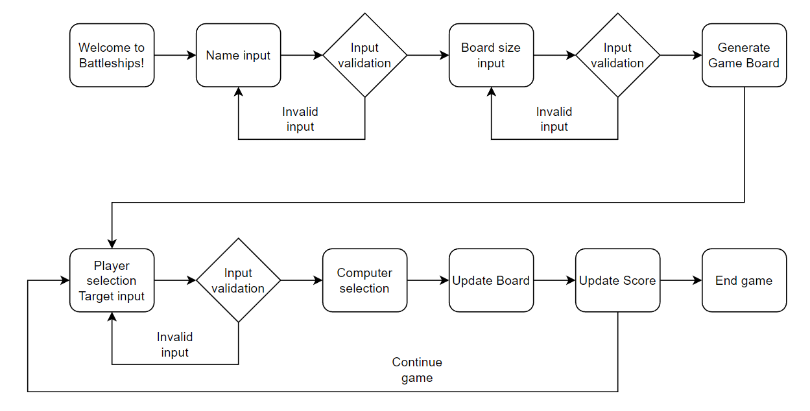

### BeautifulTable
The BeautifulTable module was used to create the game board grids in the terminal (see link in credits). According to the documentation, this module is for "easily printing tabular data in a visually appealing format to a terminal". BeautifulTable is an elegant solution for printing the game board to the terminal.

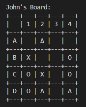
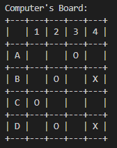

## Features
### Existing Features
- Welcome message and name input
    - The player is given the message "Welcome to Battleships!" and asked to input a name.

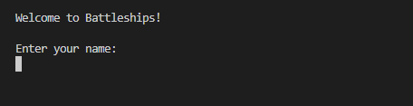 

- Name validation
    - The player must enter a name which is from 1-50 characters. It can't be an empty string. If the name input is not valid an error message is given and the player will again be asked to enter a name.

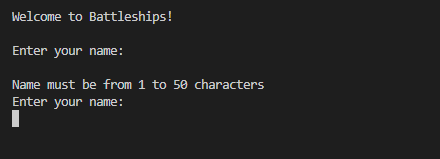 

- Board size input
    - The player can select size of game board (square grid from 3x3 up to 6x6)
    - The board size will determine the number of ships. This is done using a simple calculation: 1.3 multiplied by the board size, rounded to the nearest integer.
    - At this point the player will also be given a key showing symbols for ships, hits and misses on the game board.

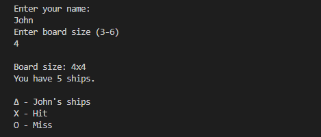 

- Board size validation
    - To select board size, the player must enter a number from 3 to 6. If anything else is entered, an error message is given and the player will be asked to re-enter a board size.

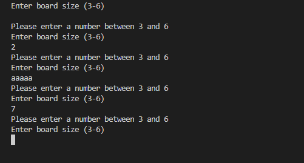

- Board generation
    - Once the board size and number of ships are confirmed, the ships will be randomly positioned on both player and computer's boards.
    - Both boards will be displayed in the terminal. The player's board will show positions of the ships. The ships on the computer board cannot be seen
    - The BeautifulTable module is used to display a visually appealing and easy to read game board to the terminal.

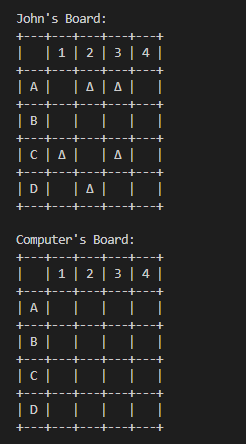

- Choose a target input
    - The player is asked to choose a target on the computer board in the letter/number coordinates format (eg. A1).
    - The letter is not case sensitive, so "a1" is the same as "A1".

- Target validation
    - If the player enters anything other than a coordinate which appears on the board, the error message "Please enter a valid coordinate" is shown.
    - If the players enters a coordinate which has already been selected, the error message "Coordinate has already been selected. Please try again" is shown.

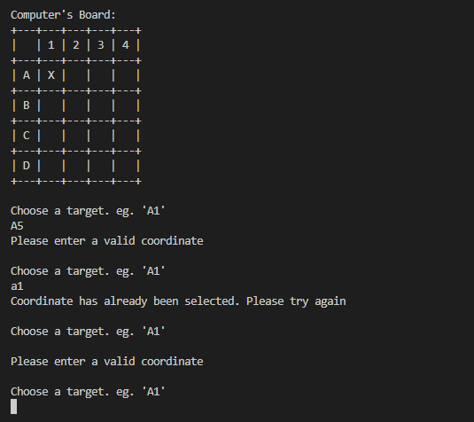

- Board update
    - The player will be informed if the selected target was a hit or miss, and the number of ships remaining on the computer's board.
    - The computer will then generate a target on the player's board using random numbers. The player will be informed if the computer's target was a hit or miss, and the number of ships remaining on the player's board.
    - The updated game board is printed to the terminal, and the player is asked for their next target input.

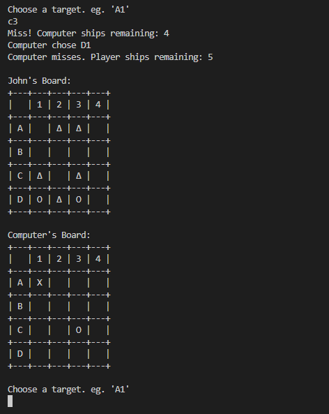

- End game
    - The game ends when the player, computer, or both, lose all of their ships.
    - The player is shown how many ships remain for both player and computer, and the result of the game (Player Wins, Computer Wins, or Game Drawn).
    - The game can be restarted by pressing Enter.

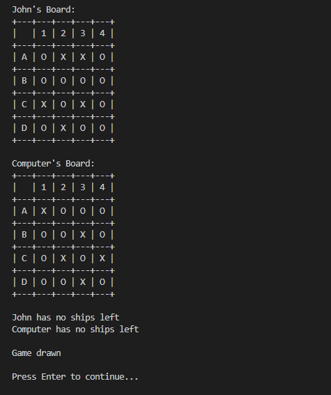

### Features to be implemented

- Allow the player to choose the number of ships the game starts with.
- Allow the player to manually position the ships on the board, instead of using a random number generator to do so.
- Add varying ship sizes from single square up to carrier (5 squares), much like the original game, and allow a larger range of board sizes to accommodate this.

## Data Model

The class Board was used as the data model. Instances of the Board class are created for both the player's and the computer's data. The data stored includes the following:
- board size
- number of ships remaining on the board
- player name
- type (human or computer)
- opponent's guesses on the board
- ship positions on the board
- table data
    - row and column headers
    - BeautifulTable()

## Testing

The code in run.py was passed through the Code Institute PEP8 linter to confirm that there were no issues.

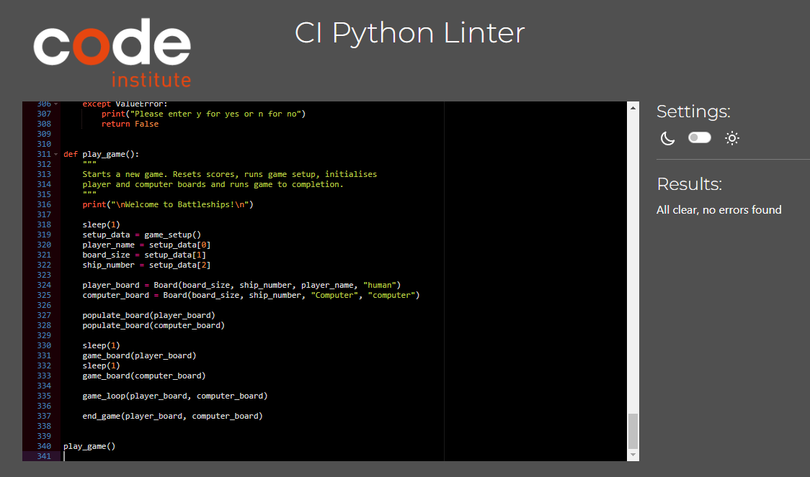

| Feature | Testing Performed | Outcome | Result |
| --- | --- | --- | --- |
| Name validation | Entered invalid name | Error message returned: "Name must be from 1-50 characters" | Pass |
| Name validation | Entered valid name | Recorded name used for remainder of game | Pass |
| Board size validation | Entered invalid data | Error message returned: "Please enter a number between 3 and 6" | Pass |
| Board size validation | Entered valid data | Game board generated in accordance with user defined board size | Pass |
| Target validation | Entered invalid data | Error message returned: "Please enter a valid coordinate" | Pass |
| Target validation | Entered duplicate data | Error message returned: "Coordinate has already been selected. Please try again"  | Pass |
| Target validation | Entered valid data | Hit or miss recorded, number of ships, list of guesses and game board all updated accordingly. | Pass |
| End game* | Play game to completion | "Player win", "Computer win" and "Game drawn" outcomes completed for all board sizes | Pass |

\* During testing, the computer's ship positions were printed to the console so that a hit or miss could be deliberately made. This allowed the tester to manufacture a win or loss, and observe the result.

### Bugs

| No | Bug | Solution |
| --- | --- | --- |
| 1 | Game would continue even when computer's ships remaining went to 0. | while/or loop on line 134 was changed to while/and loop. This means that both player's and computer's ships remaining should not equal 0 for the game to continue, and if one of those reached 0, the game would end. |
| 2 | Entering an empty target input would give an IndexError: list index out of range. | The target input string is converted to a list, but the validate target function was calling index 0 of the list before checking if the list length was 0. Calling index 0 of the list after the if statement on line 178 solved the issue. |
| 3 | Duplicate coordinates were being generated in the list of computer guesses. | The if statement on line 205 was changed to append the list if the coordinate wasn't already there (if/not in). |
| 4 | The function to update the game board was producing the TypeError: list indices must be integers or slices, not list. | The for loop on line 227 was referencing the list of guesses, instead of the length of that list. When the statement was changed from "for i in board.guesses" to "for i in range(guesses)", where "guesses" is the length of the list, the issue was resolved. |

## Deployment

- Ensure that \n is added to end of all input strings
- Update requirements.txt to ensure Heroku installs beautiful table  (pip3 freeze > requirements.txt)
- Save and push changes to github
- Login to Heroku
- Create new app
- Name app (must be unique)
- Choose region (Europe)
- Create app
- Go to Settings tab
- Config Vars
    - The key is PORT and the value is 8000
- Add Buildpacks (ensure correct order)
    - python
    - nodejs
- Go to Deploy tab
- Select GitHub and connect
- Search for GitHub repository, select and connect
- Deploy branch

##  Credits